# Procesverslag
**Auteur:** midas van Soest

Markdown cheat cheet: [Hulp bij het schrijven van Markdown](https://github.com/adam-p/markdown-here/wiki/Markdown-Cheatsheet). Nb. de standaardstructuur en de spartaanse opmaak zijn helemaal prima. Het gaat om de inhoud van je procesverslag. Besteedt de tijd voor pracht en praal aan je website.

## Bronnenlijst
1. https://css-tricks.com/almanac/
2. Lessen van Sanne
3. https://developer.mozilla.org/
4. https://stackoverflow.com/
5. https://bennettfeely.com/clippy/

## Eindgesprek (week 7/8)

-dit ging goed & dit was lastig-

Ben wezen knoeien met polygons voor de download pagina wat nog best wel lastig bleek. Ik heb me vooral gefocusd op de styling, er zijn dus wat elementen (vooral op de hoofdpagina) die er niet zijn. Dit leek mij prima omdat de verschillende elementen die ik er nog bij zou moeten voegen hebben allemaal dezelfde type code nodig en vaak zelfs minder dan wat ik bij de elementen heb gedaan die er wel staan. Het heeft nog een beetje moeite gekost om alles responsive te krijgen, vooral omdat de Blender website eigenlijk ook niet zo goed is geoptimaliseerd voor mobiel. Dus ik moest het een en ander zelf bedenken. Voor de hoofdpagina is dat uiteindelijk best goed gelukt en voor de download pagina is dat redelijk gegaan.

**Screenshot(s):**

-screenshot(s) van je eindresultaat-

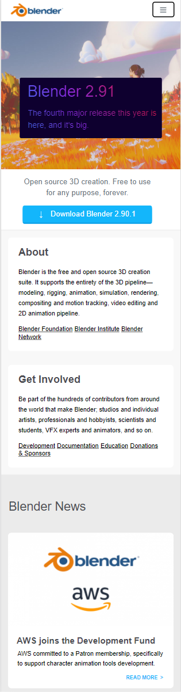

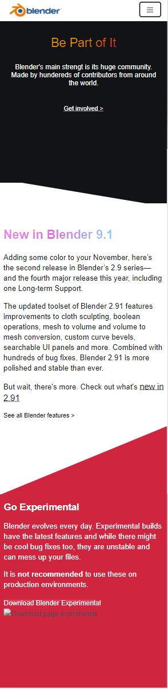

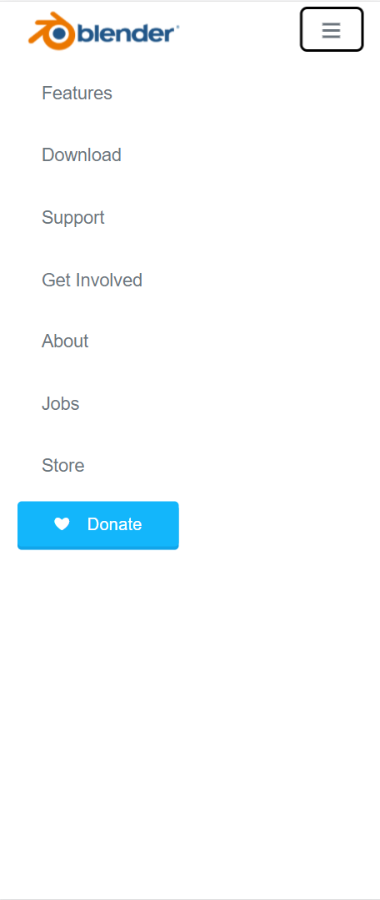

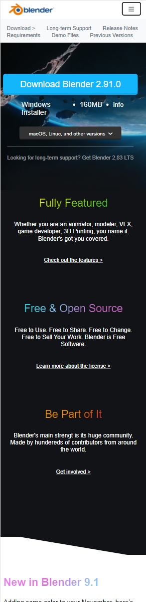

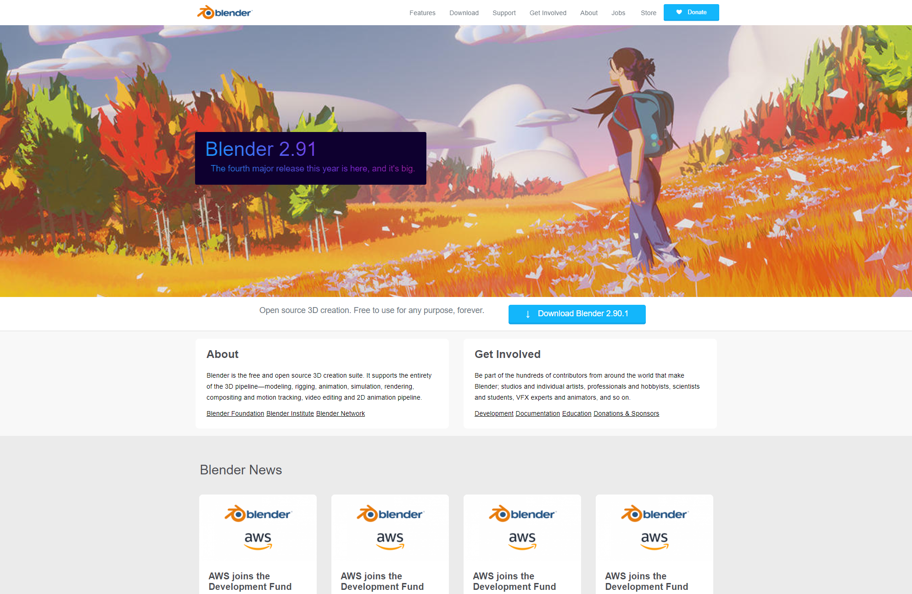

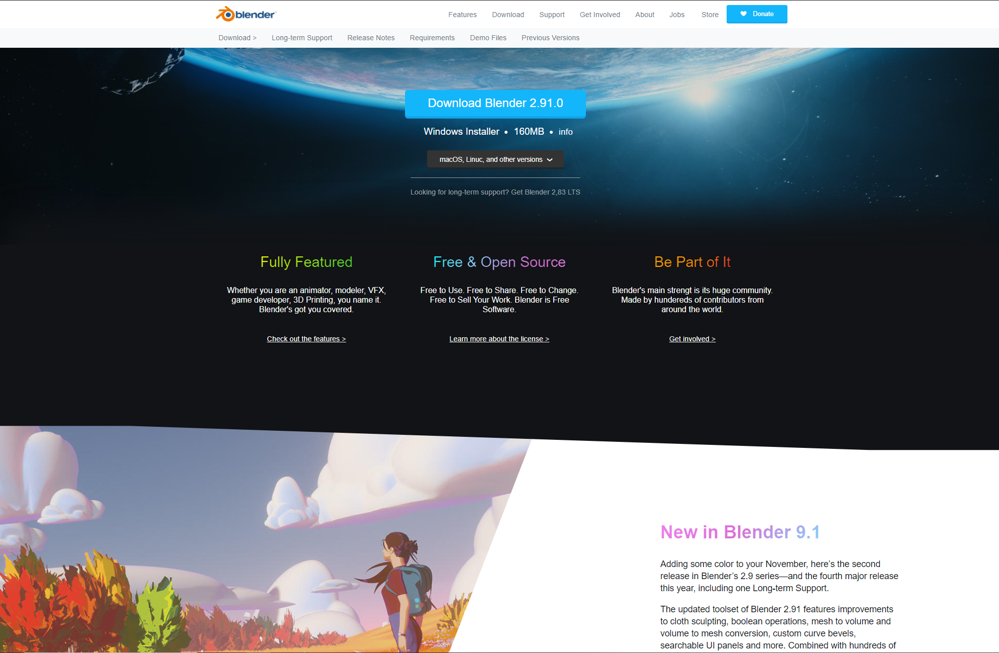

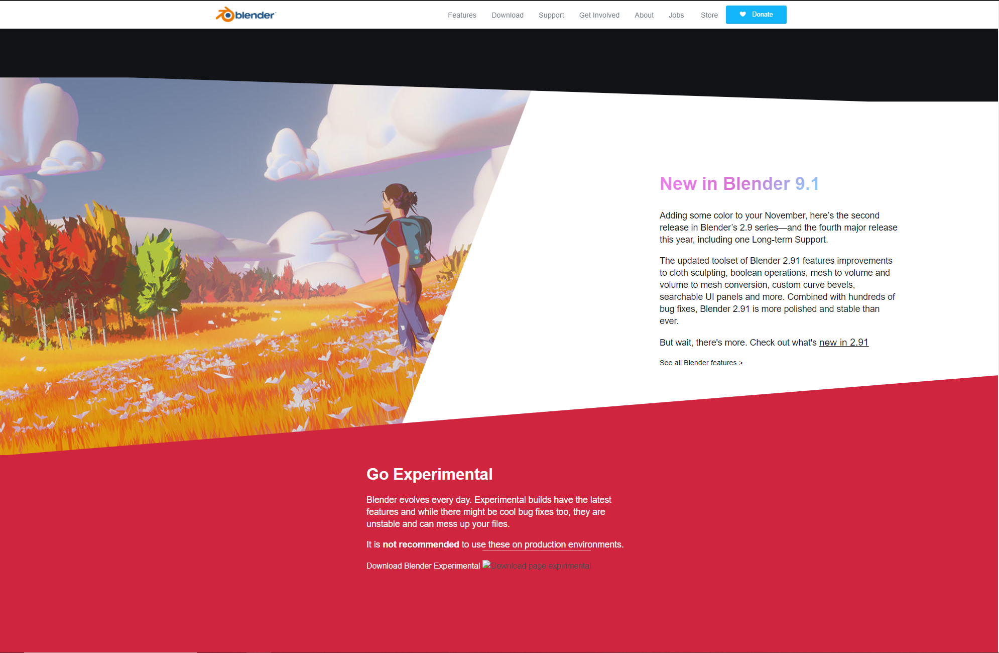

## Voortgang 3 (week 6)

-dit ging goed & dit was lastig-

Heb nogsteeds moeite met het maken van de eerste grote koptekst. De stijling krijg ik nog niet helemaal goed. Ben wel blij dat ik de animatie in die koptekst wel heb kunnen maken.

**Screenshot(s):**

-screenshot(s) van hoe ver je bent met korte uitleg-

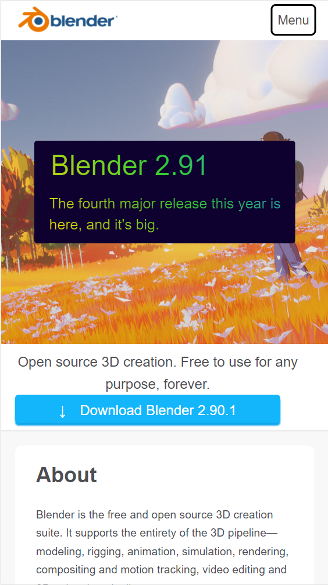

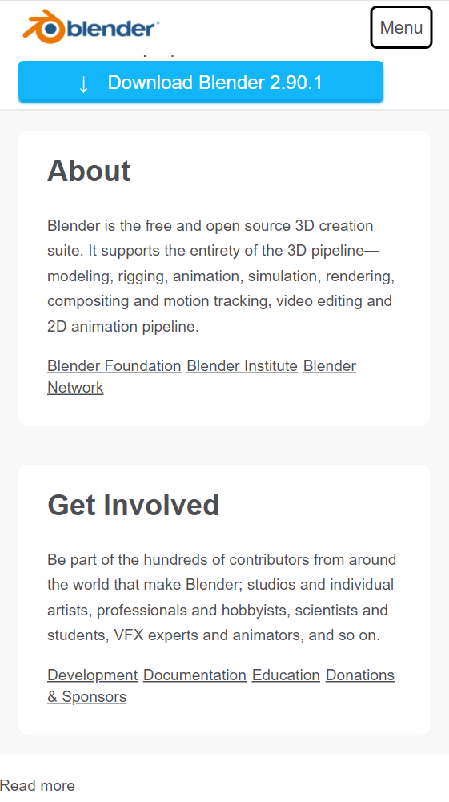

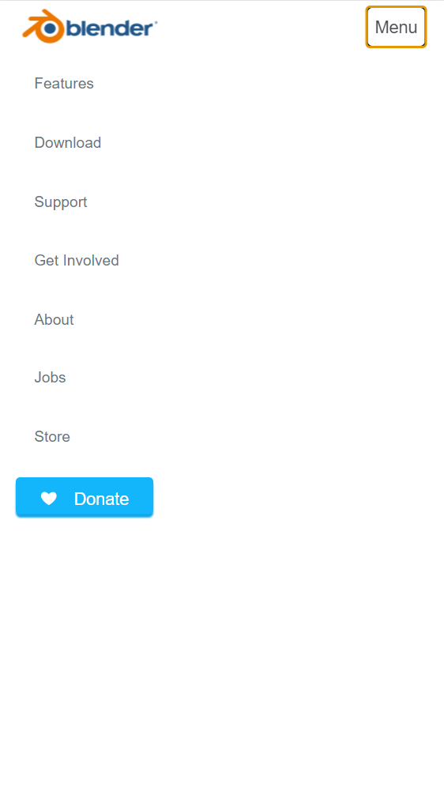

-samen met je groepje opstellen-

| Midas                                  | Moon                          | Patrick      | student 4        |
| ---                                    | ---                           | ---          | ---              |
| dit bespreken: koptekst styling        | en dit:                       | en ik dit    | en dan ik dat    |
| en dat ook nog                         | dit als er tijd is            | nog een punt | dit wil ik zeker |
| ...                                    | ...                           | ...          | ...              |

### Verslag van Screenreader ervaring

Het gebruiken van de screenreader leek prima. De verschillende links en koppen werder opgelezen en het leek me wel redelijk duidelijk wat de verschillende linkjes deden. De meeste afbeeldingen op de website zijn achtergrond afbeeldingen waar een link aan gekoppelt is. Het is me niet helemaal gelukt dit werkende te krijgen, maar door gewoon een alt toe te voegen die duidelijk maakt waar de afbeelding heen leidt was best duidelijk. De navigatie leek mij over het algemeen best goed te doen. Ook is het me gelukt langs alle elementen te komen d.m.v. de Tab knop.

## Voortgang 2 (week 5)

-dit ging goed & dit was lastig-

Ben tegen wat dingen aangelopen betreffende mijn header en eeste afbeelding. Deze problemen zijn nu opgelost met de hulp van Sanne. Ben wel erg blij met de styling van de verschillende elementen.

**Screenshot(s):**

-screenshot(s) van hoe ver je bent met korte uitleg-

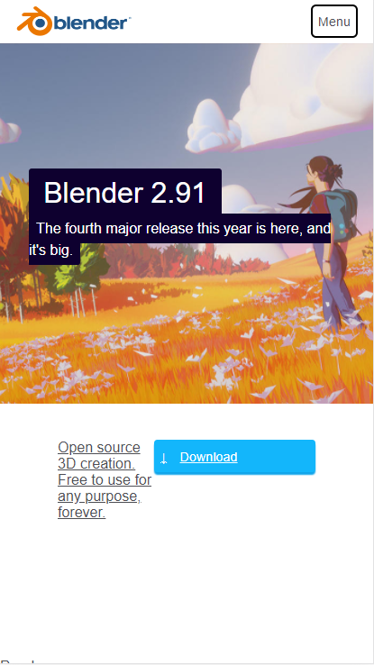

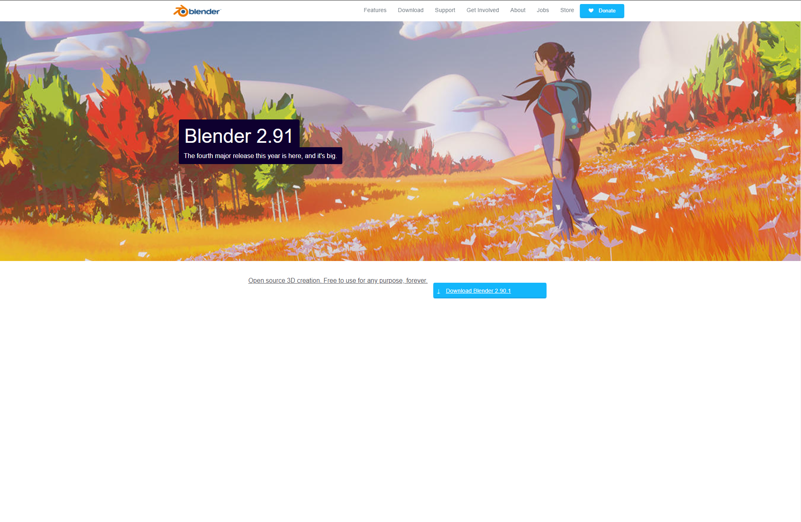

Omdat ik bezig ben met responsive kant van de opdracht heb ik alvast de stijling van zowel de mobiele als de desktop vanriant (op een minimale breedte van 56em) gemaakt.

### Agenda voor meeting

-samen met je groepje opstellen-

| Midas                                  | Moon                          | Patrick      | student 4        |
| ---                                    | ---                           | ---          | ---              |
| dit bespreken: Section 2 styling       | en dit:                       | en ik dit    | en dan ik dat    |
| en dat ook nog                         | dit als er tijd is            | nog een punt | dit wil ik zeker |
| ...                                    | ...                           | ...          | ...              |

### Verslag van meeting

-na afloop snel uitkomsten vastleggen-

## Voortgang 1 (week 3)

### Stand van zaken

-dit ging goed & dit was lastig-

Nog niet super veel gedaan. Niet echt veel problemen. Wil even checken of de html basis klopt zodat ik later in het proces geen problemen tegenkom.

**Screenshot(s):**

-screenshot(s) van hoe ver je bent met korte uitleg-

Dit is voor nu hoe de basis van mijn website is opgebouwd.

### Agenda voor meeting

-samen met je groepje opstellen-

| Midas                                  | Moon                          | Patrick      | student 4        |
| ---                                    | ---                           | ---          | ---              |
| dit bespreken: Snelle basiscode check  | en dit: Grid en Responsiveness| en ik dit    | en dan ik dat    |
| en dat ook nog                         | dit als er tijd is            | nog een punt | dit wil ik zeker |
| ...                                    | ...                           | ...          | ...              |

### Verslag van meeting

-na afloop snel uitkomsten vastleggen-

Moest een paar buttons veranderen naar links, maar voor de rest leek alles wel goed te zijn.

## Breakdownschets (week 1)

-uitwerken voor de 1e werkgroep - eind van de eerste week-

## Intake (week 1)
-uitwerken voor de kick-off werkgroep - begin van de eerste week-

**Je startniveau:** -kies uit zwart, rood óf blauw-
    rood

**Je focus:** -kies uit responsive óf surface plane-
    responsive

**Je opdracht:** -link naar de website die je gaat namaken óf de naam van je eigen ontwerp-
    https://www.blender.org/

**Screenshot(s) van de eerste pagina (small screen):**

**Screenshot(s) van de tweede pagina (small screen):**

